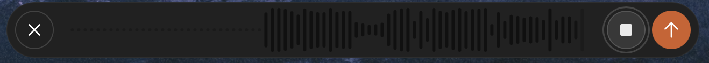

# ZenRay Dictate

A tiny macOS menu bar app: **Fn** shows or hides a small ChatGPT window,
**Cmd+D** starts and stops dictation. When you stop, the transcript is
already on your clipboard. That's the whole app.



## Why

I wanted ChatGPT's voice dictation — which I find noticeably more reliable
than the local models used by some other dictation apps, especially in
French and Japanese — available system-wide with one key, without paying for
a separate transcription API.

A caveat on that claim, so this doesn't read as more authoritative than it
is: I haven't found an independent benchmark of ChatGPT's own dictation
model to point to (it isn't listed on the couple of speech-to-text
leaderboards I checked). This is my own day-to-day experience, not a ranked
result. In my use, local models like Parakeet frequently mis-detect French
speech and fall back to English mid-sentence, and don't handle Japanese at
all, whereas ChatGPT's dictation does both. I've used it on both a ChatGPT
Plus account and a free account and haven't noticed a quality difference. It
can be a couple of seconds slower to come back than a local model, which is
a trade I'll take for fewer wrong words.

## How it works

The app keeps a hidden `chatgpt.com` session alive in a `WKWebView`. It does
not reimplement ChatGPT's transcription request. It:

1. Shows the page's own composer bar, trimmed down to just that bar (no
   sidebar, no chat history) — the black pill in the screenshot above is the
   real ChatGPT UI, not a custom recreation of it.
2. On Cmd+D, clicks whichever of ChatGPT's own `Start Dictation` /
   `Stop Dictation` buttons is currently showing (matched by an
   accessibility-label pattern, not a hardcoded string — those labels have
   changed between ChatGPT builds during development).
3. Watches the response of `POST /backend-api/transcribe`
   (`{"text": ..., "asset_format": "webm"}`) and copies the text to the
   clipboard.

No keystrokes are simulated into the page, no request is rebuilt by hand.

## A note on Terms of Service

This automates a real, logged-in ChatGPT web session rather than going
through OpenAI's official API, which is outside what OpenAI's Terms of
Service cover for automated access. It only ever touches your own account —
there's no bypassing payment, no scraping anyone else's data — but the risk
of a flag or restriction on your account is real and it's yours to carry if
you use this. I'm saying this plainly rather than dressing it up, so you can
decide with the same information I had.

## Setup

Requires macOS 14+ and a ChatGPT account (Plus or free).

```bash
git clone https://github.com/matthieuhuguet/zenray-dictate.git
cd zenray-dictate
./make-certificate.sh   # once: a local code-signing identity
./build.sh
open ZenRayDictate.app
```

**Why the certificate script.** An ad-hoc signature changes on every build,
and macOS ties the Accessibility permission to that exact signature — so
without a stable identity, Accessibility silently revokes itself on every
rebuild even though the tick in System Settings never changes. Not needed
again after the first run; `build.sh` reuses the same identity from then on.

**First run.**

1. The window opens on its own. Sign in to ChatGPT normally. The session
   persists across future launches.
2. Grant the microphone when asked. If Fn does nothing outside the app,
   grant Accessibility too (System Settings → Privacy & Security →
   Accessibility).
3. System Settings → Keyboard → "Press 🌐 key to" → **Do Nothing**. Without
   this, macOS intercepts Fn for its own emoji picker or dictation before the
   app ever sees it.

**Using it.** Cmd+D anywhere: the bar appears, dictation starts. Talk. Cmd+D
again: it stops, and the text is on your clipboard — `Cmd+V` to paste. Fn
shows or hides the window on its own, independent of dictation.

## Known limitations, help wanted

- **Fn doesn't reliably bring the window back once it's lost focus** — click
  another app, and pressing Fn again sometimes does nothing; you have to
  click the app's Dock icon instead. I'd genuinely like help tracking this
  down — issues and PRs welcome.
- Cmd+D is a system-wide shortcut while this app is running, so it stops
  reaching Cmd+D in other apps (Safari's bookmark shortcut, Finder's
  Duplicate) for as long as ZenRay Dictate is open.
- Dictation opens in a temporary ChatGPT chat, so nothing is saved to your
  ChatGPT history.
- If ChatGPT changes its accessibility labels again, the button matching in
  `bridge.js` may need a small update.

## Compared to

| | Cost | Model |
|---|---|---|
| **ZenRay Dictate** | Free (uses your ChatGPT account) | ChatGPT's dictation, cloud |
| [SuperWhisper](https://superwhisper.com) | Free tier + Pro ($8.49/mo or a one-time lifetime price) | Local + cloud models |
| [Handy](https://github.com/cjpais/Handy) | Free, open source (MIT) | Fully offline, local models |

Handy in particular is free and open source, contrary to what I first
assumed when writing this — worth a look if you'd rather everything stay
local and never touch a ChatGPT account.

## Project layout

| File | Role |
|---|---|
| `main.swift` | Entry point, regular app so it also gets a Dock icon |
| `AppDelegate.swift` | Menu bar, permissions at launch, wires Cmd+D and Fn |
| `ChatWindow.swift` | The window: compact composer bar, sign-in mode, JS bridge, clipboard |
| `GlobalHotKey.swift` | Cmd+D via `RegisterEventHotKey` — no permission required |
| `FnKeyMonitor.swift` | Fn via a listen-only `CGEventTap` — needs Accessibility |
| `LoginItem.swift` | Launch at login, via `SMAppService` |
| `Permissions.swift` | Microphone and Accessibility helpers |
| `Log.swift` | Plain text log at `~/Library/Logs/ZenRayDictate.log` |
| `Resources/bridge.js` | Everything that touches the ChatGPT page itself |
| `Entitlements.plist` | Declares microphone access under the hardened runtime |
| `make-certificate.sh` | One-time local signing identity, see Setup |

## License

MIT. See [LICENSE](LICENSE).
