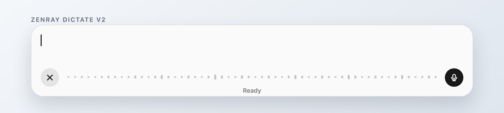

## 3 October 2026: Direct Gemini capsule

The default window now contains Gemini's actual `input-container` DOM, with the website's live microphone. The signed 3.1 app uses a transparent borderless panel, 720 points wide, whose height follows the composer. Its legal footer is hidden in compact mode; the full Gemini session remains available from the menu. (3 October 2026)

The input is pinned to the built-in MacBook microphone by CoreAudio at startup and on default-input changes. AirPods remain available as output. The web media constraints discard old AirPods input IDs, prefer the named built-in input and otherwise use the pinned system default. (3 October 2026)

The native Gemini recording animation stays inside the original composer DOM. No copied waveform, second MediaStream, canvas or audio analyser is added. Its appearance depends on Gemini's recording state and existing draft. (3 October 2026)

Hold Fn for the website microphone; double Fn or Fn+Space keeps it running; Control+D and Command+D toggle it. Control+Q stops and hides the capsule. Drafts remain editable in Gemini. Native history/import/custom modes/Command Mode remain available through the library and advanced native composer; direct Gemini editing does not automatically run that native processing pipeline. Whisper fallback is off by default and has been disabled in the current library. (3 October 2026)

# ZenRay Dictate with Gemini (3 October 2026)

The backend is the Gemini website at gemini.google.com, running in a dedicated app session. The native 18 px composer remains available. No Codex login or paid Gemini API key is required. (3 October 2026)

Hold Fn to dictate and release to transcribe and paste into the active field. Double Fn or Fn+Space enables hands-free; Control+D toggles it. Hold Control+Shift+D to speak a command for the selected text, or generate at the cursor. Command+D retains the original composer recording cycle, and Control+Q cancels. Fn can still show/hide the composer when Hold Fn to dictate is disabled. (3 October 2026)

Open Library, History and Settings from the app or menu bar. Record a custom shortcut, choose the engine and mode, edit custom prompts and per-app rules, import dictionary CSV, add replacements and snippets, correct history entries, or import/drop audio and video. History replay selects its own mode without changing the active one. (3 October 2026)

Gemini supplies transcription and cloud text processing. Installed Whisper and Parakeet are optional local engines; the 100% local switch skips Gemini, including cloud formatting. Local-only mode applies vocabulary, replacements and snippets but does not run a local language model for prompts. Quiet-audio mode boosts capture gain. Screen context reads the focused accessible window and field for spelling, not a screenshot. (3 October 2026)

Successful audio is discarded by default. Opt into Keep audio for later re-transcription; otherwise history can reformat its saved raw text. Failed recordings persist for retry. Settings, modes, vocabulary and history live in ~/Library/Application Support/ZenRayDictate/Library/Library.json. Audio and Pending are below that same folder. Authentication remains in WebKit's separate app profile. (3 October 2026)

Build with ./build.sh, then open ZenRayDictate.app. Grant microphone and Accessibility permissions when macOS asks. Set the macOS globe-key action to Do Nothing yourself to avoid conflicting system actions. Open Gemini session / Sign in if the site requires an account, and select the model whose visible name matches settings. (3 October 2026)

Ten library tests, bridge failure checks and signed bundle checks are reproducible using swift test, node Scripts/VerifyGeminiBridge.mjs, and bash Scripts/verify-independent-composer.sh. [Transport notes and functional probe](Scripts/README-Gemini.md) describe the verified website connection. (3 October 2026)

The documentation below is the historical V2 state; the Gemini section above governs the current backend and controls. (3 October 2026)

# ZenRay Dictate V2

V2 released on 2026-09-12. The empty editor no longer overlays a placeholder label, so the insertion bar remains fully visible and cannot cut through the first character.



[Read the complete V2 patch notes](docs/patch-notes-v2.md).

ZenRay Dictate is a separate macOS app that recreates the useful Codex composer interaction in an independent native window. The installed Codex chat remains its own app and is never embedded or controlled by this project.

The window keeps one editable prompt area at the top and one recording bar at the bottom. While recording, it shows only the waveform. When recording stops, the app sends the saved WAV to the Codex transcription endpoint, inserts the returned text into the prompt area, and copies the complete prompt to the clipboard.

If the Codex request fails, the installed local Whisper MLX engine is tried. If both paths fail, `last-recording.wav` stays in Application Support and the Retry action uses that exact recording again.

## Controls

- `Control+D` or the legacy `Command+D` starts or stops dictation.
- `Control+Q` cancels the current recording without changing the prompt.
- Clicking outside the composer fades it out.
- `Fn` shows or hides the composer.
- `Command+Q` clears the complete composer text.
- `Command+X` copies the complete composer text, then clears it.
- `Command+C` copies the selected text.
- `Command+V` pastes plain text into the composer.
- The `x` button clears the prompt when idle and cancels recording while recording.
- The circular microphone button starts a new recording after a failed transcription. The menu bar can retry the last saved recording.
- The menu bar item can show, copy, paste, clear, or retry the composer and its last copy.

The composer keeps a fixed `860 x 140` point frame and opens at the bottom center of the active screen, above the Dock area. Long prompt text wraps inside the editor and scrolls there instead of resizing the window.

The UI and flow are an independent reimplementation based on the visible Codex composer behavior. No Codex or ChatGPT source code is bundled.

## Setup

Requires macOS 14+, the existing Codex login in `~/.codex/auth.json`, and the local ASR environment at `~/.venvs/asr-ja`.

```bash
./make-certificate.sh
./build.sh
open ZenRayDictate.app
```

The first recording asks for microphone access. The Fn control asks for Accessibility access when macOS has not granted it yet.

## Project layout

| File | Role |
|---|---|
| `main.swift` | App entry point |
| `AppDelegate.swift` | Window lifecycle, menu bar, and global shortcuts |
| `ComposerWindowController.swift` | Independent Codex-style composer and retry state |
| `AudioCapture.swift` | WAV capture and waveform levels |
| `Transcriber.swift` | Codex endpoint, local Whisper fallback, and response validation |
| `GlobalHotKey.swift` | System-wide Control+D, legacy Command+D, and Control+Q shortcuts |
| `FnKeyMonitor.swift` | System-wide Fn visibility control |
| `Log.swift` | Log at `~/Library/Logs/ZenRayDictate.log` |
| `Entitlements.plist` | Audio input entitlement |
| `Scripts/verify-independent-composer.sh` | Repeatable build and bundle checks |

## License

MIT. See [LICENSE](LICENSE).
