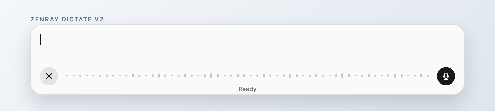

# ZenRay Dictate V2

Released 2026-09-12 as tag `v2.0.0`.

## Correctif principal

Le texte indicatif `Ask anything` est retiré de l’éditeur vide. Le caret natif reste seul dans la zone de saisie, si bien qu’aucun calque ne peut couper le premier caractère ou créer un faux décalage vertical.

## Interface V2

- Le composer reste une seule fenêtre native indépendante de Codex.
- La fenêtre reste fixe à `860 x 140` points.
- La fenêtre s’ancre en bas au centre de l’écran, depuis `NSScreen.visibleFrame`, avec un inset inférieur de `24` points.
- Le texte long se renvoie à la ligne dans l’éditeur et ne pousse jamais la fenêtre vers la droite ni vers le haut.
- Le champ de transcription live instable reste supprimé : il n’existe qu’une zone de texte utilisateur.
- Les deux boutons sont contraints par une largeur et une hauteur égales, puis dessinent leur fond dans un carré, ce qui conserve des cercles parfaits au runtime.
- Les icônes SF Symbols restent proportionnellement réduites dans les boutons carrés.
- Le rendu de référence du composant est fourni par `docs/v2-component.html` et exporté en `docs/v2-component.jpg`.

## Contrôles conservés

- `Control+D` et l’ancien `Command+D` démarrent ou arrêtent la dictée.
- `Control+Q` annule l’enregistrement sans modifier le prompt.
- Un clic hors de la fenêtre fait disparaître le composer avec un fondu.
- `Fn` affiche ou masque le composer.
- `Command+Q` efface tout le prompt.
- `Command+X` copie tout le prompt puis l’efface.
- `Command+C` copie la sélection.
- `Command+V` colle du texte brut dans la zone éditable.
- Le bouton `x` efface le prompt au repos et annule l’enregistrement en cours.
- Le bouton principal relance le dernier enregistrement sauvegardé après un échec.
- Le menu de la barre système propose l’affichage, la copie, le collage, l’effacement et les retentes.

## Transcription et reprise

- L’audio est sauvegardé dans `~/Library/Application Support/ZenRayDictate/Pending/last-recording.wav` avant chaque tentative.
- La transcription utilise l’endpoint Codex, puis le moteur Whisper MLX local si l’endpoint échoue.
- Une transcription réussie est insérée dans le prompt complet et copiée automatiquement.
- Un échec conserve le WAV et expose une retente après relancement de l’application.
- Un échec de copier-coller conserve aussi le dernier texte en mémoire pour `Retry last copy`.
- Codex et son chat restent ouverts séparément : aucun code WebKit ni interface ChatGPT Web n’est embarqué.

## Preuves de cette version

- `./build.sh` compile, assemble et signe `ZenRayDictate.app` en version `2.0`, build `2`.
- `./Scripts/verify-independent-composer.sh` vérifie le bundle, l’absence de WebKit, les contrôles, les cercles et le placement fixe.
- La capture runtime du composer relancé confirme visuellement que le caret reste entièrement visible dans la zone vide.
- La mesure Accessibility précédente confirme une fenêtre `860 x 140` et des boutons carrés `38 x 38` au runtime.
- Le dépôt GitHub reçoit le commit V2 et le tag `v2.0.0`.
